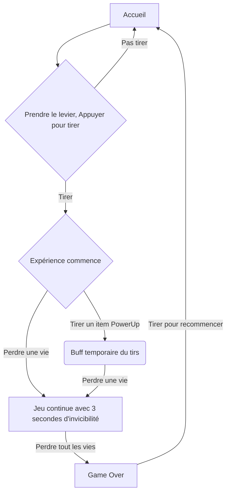
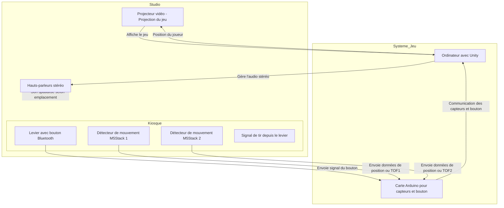
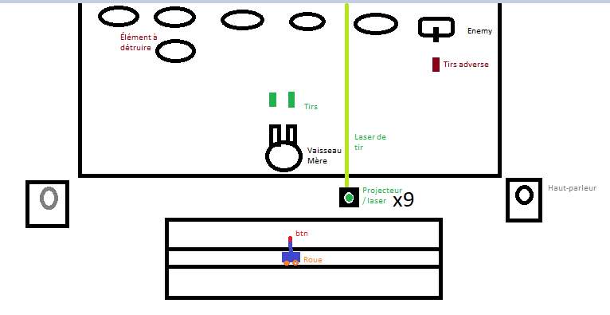
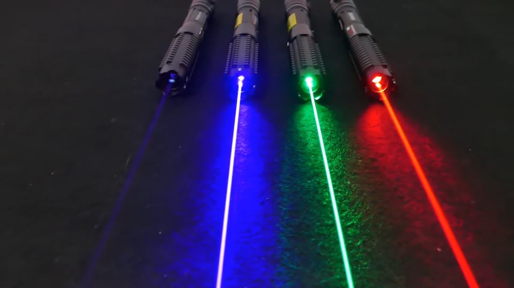
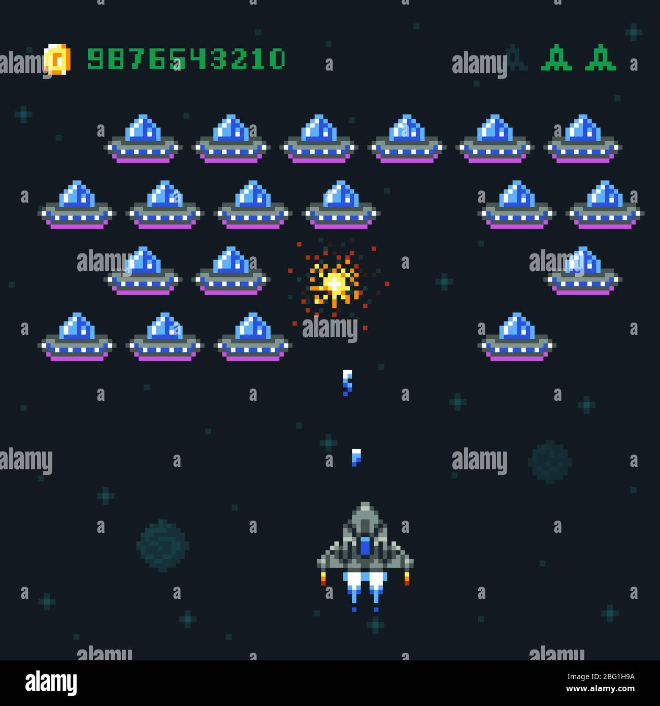
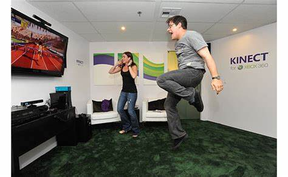
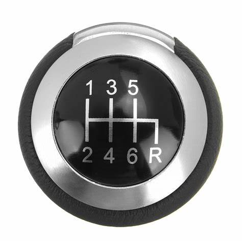

### Projet Odysée Mécanique
## Planification Technique

# Description
Planification complète d'une installation multimédia interactive en traitant les aspects conceptuels, scénaristiques, techniques et logistiques.

Livrable: Document technique en ligne avec URL

Cette activité consiste à concevoir une planification détaillée pour un projet multimédia, intégrant la réflexion sur le concept, le scénario interactif, le scénarimage, le synoptique, la plantation des dispositifs, ainsi que l’anticipation des besoins matériels et logiciels.
# Communication
## Concept
Recréé un atmosphère des années 1978 avec le jeu d'arcade réinventer de Space Invaders. Les joueurs seront poussé à faire competition pour battre le record du plus grand concurrent antécédant.

Je veux intégrer les connaissances apprises pendant la technique pour effectuer un jeu avec une capacité physique mobile pour que le testeur/joueur est une expérience de cette arcade bien plus réaliste et immersive avec les lasers et tout.
## Scénario
Le joueur sera invité à jouer au jeu. Pour débuter le jeu, il devra actionner le bouton [Appuyer pour tirer].

Le jeu débutera alors de difficulté croissante. Débutant ainsi relativement lentement. Le joueur devra déplacer le levier de gauche à droite pour déplacer son vaisseau tireur. Il devra aussi esquiver les tirs ennemies et appuyer sur le bouton pour tirer les cibles aussi.

Le joueur pourra attraper des Pouvoirs temporaires en jeu lui procurant un avantage temporel.

Le joueur aura trois vies, pour lequel il détiendra d'un 3 secondes d'immunité à chaque perte de vie.

Une fois la partie terminé, il pourra soit partir, ou réappuyer [tirer] pour recommencer une autre partie.
## Scénarimage

## Synoptique

*  1 x Installation interactive
* Projection vidéo
* Stock M5Stack
## Plantation

## Besoins matériels

# Visualisation

# Inspiration
## Moodboard visuel

## Moodboard Sonore
### Ambiance
Ambiance espace de style à suivre une musique très pensive comme https://www.youtube.com/watch?v=LlN8MPS7KQs où https://www.youtube.com/watch?v=c56t7upa8Bk. Je veux une ambiance qui laisse pensée que le monde est infini où espoir. J'optes bien plus pour snowfall.

Je veux une ambiance sombre pour laisser les éclairage gérer l'expérience. Les couleurs bien plus sombre.
* rouge vin [Laser ou lumière simulant laser]
* vert Orchidée [Tirs fusils, Powerups]

# Technologie utilisé
* Arduino [Détection de l'emplacement du levier]
* Unity &/où VsCode [Interface du jeu projeté]
* AfterEffect [Animation SpriteSheet]
* Lumière AmericanDJ [Ambiance lumineuse]
* Reaper [Montage sonore]
# Matériel
* 9 lasers activable à distance 
* 9 time of flight m5 stack, un meuble
* un levier
* 1 Mechanical Key Button Unit M5stack
* une affiche du jeu que l'on peut coller sur le meuble
* ordinateur
* fils électriques (tout en général)
* système de rail [DEPEND SYSTÈME UTILISÉ]
* feutres de protections
* haut-parleurs

###### *Documentation par Isaac Fafard