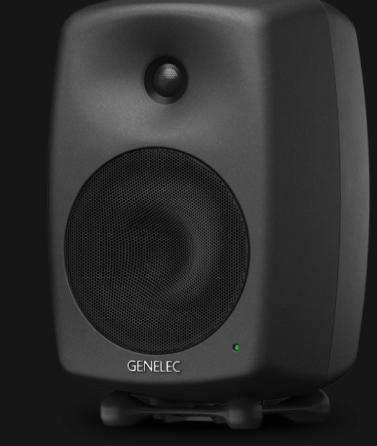

### Projet Odysée Mécanique
## Planification Technique

# Description
Planification complète d'une installation multimédia interactive en traitant les aspects conceptuels, scénaristiques, techniques et logistiques.

Livrable: Document technique en ligne avec URL

Cette activité consiste à concevoir une planification détaillée pour un projet multimédia, intégrant la réflexion sur le concept, le scénario interactif, le scénarimage, le synoptique, la plantation des dispositifs, ainsi que l’anticipation des besoins matériels et logiciels.
# Communication
## Concept
Recréé un atmosphère des années 1978 avec le jeu d'arcade réinventer de Space Invaders. Les joueurs seront poussé à faire competition pour battre le record du plus grand concurrent antécédant.

Je veux intégrer les connaissances apprises pendant la technique pour effectuer un jeu avec une capacité physique mobile pour que le testeur/joueur est une expérience de cette arcade bien plus réaliste et immersive avec les lasers et tout.

# Visualisation

# Inspiration
## Moodboard visuel
 Pas valide

En Vectoriel

## Moodboard Sonore
### Ambiance
Ambiance espace de style à suivre une musique très pensive comme https://www.youtube.com/watch?v=LlN8MPS7KQs où https://www.youtube.com/watch?v=c56t7upa8Bk. Je veux une ambiance qui laisse pensée que le monde est infini où espoir. J'optes bien plus pour snowfall.

Je veux une ambiance sombre pour laisser les éclairage gérer l'expérience. Les couleurs bien plus sombre.
* rouge vin [Laser ou lumière simulant laser]
* vert Orchidée [Tirs fusils, Powerups]

## Scénario
Le joueur sera invité à jouer au jeu. Pour débuter le jeu, il devra actionner le bouton [Appuyer pour tirer].

Le jeu débutera alors de difficulté croissante. Débutant ainsi relativement lentement. Le joueur devra déplacer le levier de gauche à droite pour déplacer son vaisseau tireur. Il devra aussi esquiver les tirs ennemies et appuyer sur le bouton pour tirer les cibles aussi.

Le joueur pourra attraper des Pouvoirs temporaires en jeu lui procurant un avantage temporel.

Le joueur aura trois vies, pour lequel il détiendra d'un 3 secondes d'immunité à chaque perte de vie.

Une fois la partie terminé, il pourra soit partir, ou réappuyer [tirer] pour recommencer une autre partie.
## Scénarimage

## Synoptique

### Kiosque

### Son & Vidéo

### Informatique

### Interaction

## Plantation

## Études matériels
*  1 x Installation interactive
* Projection vidéo
* Ordinateur (Arduino & Unity avec Plugdata comme osc communication)
* Stock M5Stack
    - 1 Mechanical key [Bluetooth version]
    - 2 TOF ou 3 PIR M5Stack
* Kiosque rectangulaire
* Ordinateur

### Etude Projecteur

Servira à projeter l'expérience sur une étandue élevé. Placé pas trop loin pour éviter une pollution visuels des pixels.
https://www.bureauengros.com/products/3094403-fr-optoma-technology-4k400stx-projecteur-dlp-4k-uhd-a-courte-focale-4-000-lumens 

### Etude Kiosque

Servira à l'interactivité. C'est l'endroit ou le joueur pourra intéragir avec l'expérience en tant que telle. Ce kiosque sera aménagé avec tout les matériels pour le bon fonctionnement de l'expérience.
### American DJ

Lumière directement visé sur le kiosque tout en évitant tout intensité trop élevé. Accorde une luminosité minimale pour intéragir avec l'expérience.
https://www.adj.com/5px-hex
### Etude Equipement M5Stack
#### Etude Bouton

Batton avec bouton pour tirer. il est une visualisation de ce que je veux reproduire. Le batton sera toutefois fait à la main et ressemblera bien plus à ça : 

#### Etude TOF

Le "Time of Flight" de M5Stack sera utilisé pour détecter l'emplacement du levier.
https://eu.mouser.com/new/m5stack/m5stack-tof-distance-sensor/ 
#### Etude Key Unit

Placé directement sur le triggerstick, il sera le bouton bluetooth qui communiquera avec Arduino. À l'action, il enverra un message comme expliqué dans le synoptique. [OSC]
https://www.tinytronics.nl/en/switches/manual-switches/push-buttons-and-switches/m5stack-button-unit 

### Etude Speaker

Positionner sur le plafond du studio.
https://www.genelec.com/8040b 

### Etude Câbles
* Câble XLR https://www.amazon.ca/AmazonBasics-C%C3%A2ble-microphone-m%C3%A2le-femelle/dp/B01JNLTTKS/ref=sr_1_1_ffob_sspa?dib=eyJ2IjoiMSJ9.Qc7Bm99GBP3_XdgZcQz45tvwI3ZqROZzvEu4V-F-QT388d0dx-YLODgUtsRmCb0TR1FPGUPEwhox88PlZm-JDHYXqmpN1VxeKf3W5k1g5NU1RZ2TFPbPHEgvEOSrXuJr0p9KFPer01MgBdV8xSHpXD5YZ1GfRCRcvu-F_YgfHtW0nnIjJADUKZ3dbmYpX97Y90rhmCpxBn37eHkWwjjazddP0l0gZG9GyMqQk0WBrxC5mV0aQjAITQ2gDr7Wvfz22xvF73O-EgQPh9p3sYhI7UYglNw0inOt6GjZYTSyBVE.dWFeMSa3GcqU8O-ySO4vj7Pt5r6aBAjf_mexNg1_OKA&dib_tag=se&hvadid=208379556679&hvdev=c&hvlocphy=9000598&hvnetw=g&hvqmt=e&hvrand=5867566891861396795&hvtargid=kwd-299658550019&hydadcr=5480_9838916&keywords=cable%2Bxlr&qid=1730664946&sr=8-1-spons&sp_csd=d2lkZ2V0TmFtZT1zcF9hdGY&th=1 
* Câble XLR vers USB https://www.amazon.ca/femelle-microphone-adaptateur-instruments-enregistrement/dp/B07WR14TYX/ref=sr_1_4_sspa?__mk_fr_CA=%C3%85M%C3%85%C5%BD%C3%95%C3%91&crid=2IOWF3QHGFSZN&dib=eyJ2IjoiMSJ9.dQGpMpgA9Iulza1HVu-XlK5gRTuLdXG4dKc3tbkKYKA-jMTHiCHNEq1TxnnkXODERf6h6RV-d2g33HtukI6CtW-rpr89U-fAFdxlsNMZ4OfGr21F6ud2zMlh0LZVeyRD0NEMft_wn6JiwvrKmUaYTlQTdfAbuoZpqtVW8t33pGZMe2eCrpvzHhdHhy04AVP7s8HqiZ-ufZRq5aGKWQAI3qPhduy1nDt4jcRi3K5roeoHq32kwXn4Mz8g2hQ1RTwyvAErp7RcdgnHTD0Kfsecbc5vVrnb_O79Sg42bqguw1c.Nf0Li0DKLt-J9auJCgwXc5akNUq49SsF3rtb7SSuqas&dib_tag=se&keywords=cable+xlr+usb&qid=1730665110&sprefix=cable+xlr+usb%2Caps%2C83&sr=8-4-spons&sp_csd=d2lkZ2V0TmFtZT1zcF9hdGY&psc=1 
## Visiteurs
Les visiteurs auront une zone auquel il ne pourront pas traverser si un autre visiteur est dans cette zone. Limitant tout risque de contact et risque de blessure.
## Câblage
Étant donné que l'installation est dans le studio, le stock peut être caché dans le kiosque. Les prises dans le sol permettent de cacher les fils et pour ceux du projecteur et et speakers au plafond, il sera simple de placer les fils pour qu'ils longent un mur inutilisé. 
## Logiciels & Réseaux
### Logiciels:
* Unity
* PlugData
* Arduino
### Réseautage:
Arduino communique grâce à une communication OSC vers Unity dans l'ordinateur. Unity générera le son transmis au travers les speakers et la projection sera celle que Unity génerera grâce à l'OSC.

Les Time Of Flights envoyeront des données pour calculé l'emplacement du vaisseau mère.

# Technologie utilisé
* Arduino [Détection de l'emplacement du levier]
* Unity &/où VsCode [Interface du jeu projeté]
* AfterEffect [Animation SpriteSheet]
* Lumière AmericanDJ [Ambiance lumineuse]
* Reaper [Montage sonore]
# Matériel
* 9 lasers activable à distance 
* 9 time of flight m5 stack, un meuble
* un levier
* 1 Mechanical Key Button Unit M5stack
* une affiche du jeu que l'on peut coller sur le meuble
* ordinateur
* fils électriques (tout en général)
* système de rail [DEPEND SYSTÈME UTILISÉ]
* feutres de protections
* haut-parleurs

###### *Documentation par Isaac Fafard